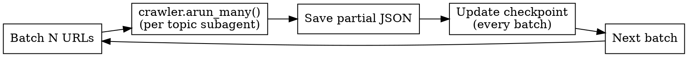

# Search Docs with Crawl4AI

Automated documentation extraction using Crawl4AI Python library with subagent isolation.

**CRITICAL:** This skill uses Crawl4AI (Python library), NOT Firecrawl MCP tools. Do not mix tooling.

## Quick Reference

| Concurrency | Batch Size | Delay Between Batches |
|-------------|------------|-----------------------|
| max_concurrent=5 | 5-10 URLs | 2-3s |
| max_concurrent=10 | 10-20 URLs | 1-2s |

**Output:** `data/<api>.json`

---

## Phase 1: Discovery

Use Crawl4AI to discover all URLs from the main page:

```python
from crawl4ai import AsyncWebCrawler, CrawlerRunConfig

async with AsyncWebCrawler() as crawler:
    result = await crawler.arun(base_url)
    internal_links = result.links.get("internal", [])
```

**Important:** Crawl4AI returns links as part of `result.links`. Filter by patterns:

```python
doc_links = [url for url in internal_links
             if "/docs/" in url or "/api/" in url or "/guide/" in url]
```

Subagent classifies URLs into topic groups. Present tree to user:

```
api-name/
  authentication/
  models/
  api-reference/
    endpoints/
    errors/
```

**Wait for user approval before extraction.**

---

## Phase 2: Completeness Check

Subagent critic analyzes for gaps:
- Sublinks mentioned but not included
- Sidebar modules not in list
- Breadcrumbs indicating deeper hierarchy

Present gaps to user. Loop until user approves structure.

---

## Phase 3: Directory Setup

```
input/<api-name>/
  _metadata.json     # crawl info, date, version
  _checkpoint.json   # recovery progress
  <topic>/
    page1.json       # partial JSON per page
    page2.json
```

**_metadata.json structure:**
```json
{
  "name": "api-name",
  "base_url": "https://docs.example.com",
  "crawl_started": "2025-01-19T10:00:00Z",
  "discovered_urls": 45,
  "topics": ["auth", "models", "endpoints"]
}
```

**_checkpoint.json structure:**
```json
{
  "completed_urls": ["url1", "url2"],
  "failed_urls": [],
  "current_batch": 3,
  "last_updated": "2025-01-19T10:15:00Z"
}
```

---

## Phase 4: Parallel Extraction



**Crawl4AI extraction pattern:**

```python
from crawl4ai import AsyncWebCrawler, CrawlerRunConfig

config = CrawlerRunConfig(
    page_timeout=30000,
    remove_overlay_elements=True,
    excluded_tags=["nav", "footer", "aside"],
    css_selector=".main-content"  # Adjust per site
)

async with AsyncWebCrawler() as crawler:
    results = await crawler.arun_many(
        urls=batch_urls,
        config=config,
        max_concurrent=5
    )
```

- One subagent per topic (context isolation)
- Each subagent generates JSON with keywords/use_cases/tags/priority
- Save checkpoint after EVERY batch (not every 5)

---

## Phase 5: Error Handling

| Error | Strategy |
|-------|----------|
| Timeout | Retry with page_timeout=60000 |
| Empty content | Warning, skip |
| Short content (<100 chars) | Include with `low_quality: true` |
| Large content (>50KB) | Split into multiple sections |
| JS-heavy page | Add wait_for="css:.content" |

**Retry pattern:**

```python
for url in failed_urls:
    config = CrawlerRunConfig(
        page_timeout=60000,
        wait_for="css:.main-content"
    )
    result = await crawler.arun(url, config=config)
```

Checkpoint saved every batch. Resume from checkpoint on failure.

---

## Phase 6: Merge and Validation

1. Merge all partial JSONs into `data/<api>.json`
2. Subagent reviewer compares discovered vs extracted
3. Generate final report:

```
URLs discovered: 45
URLs extracted: 43
Skipped: 2 (empty content)
Sections generated: 127
Quality warnings: 3 low_quality sections
```

---

## JSON Schema

```json
{
  "name": "api-name",
  "display_name": "Display Name",
  "version": "v1",
  "base_url": "https://docs.example.com",
  "sections": [{
    "title": "Section Title",
    "path": "section-slug",
    "url": "https://docs.example.com/section",
    "keywords": ["6-10 terms"],
    "use_cases": ["how to X", "when to Y"],
    "tags": ["getting-started", "api-reference"],
    "priority": 10,
    "content": "# Markdown content..."
  }]
}
```

**Priority scale:** 10=essential (auth, quickstart), 8-9=core features, 5-7=secondary, 1-4=edge cases

---

## Keyword/Use Case Generation

Each subagent generates keywords and use_cases from content:

**Keywords (6-10 terms):**
- Extract from H1/H2/H3 headers
- Extract code identifiers in backticks
- Extract API terms (endpoint, parameter, response)
- Deduplicate and limit

**Use cases (3-5 phrases):**
- "How to [action from title]"
- "When to use [feature name]"
- "Troubleshooting [error type]"

---

## Subagent Dispatch Pattern

Use Task tool with `subagent_type="general-purpose"` for:

1. **Discovery classifier** - Categorize URLs into topics
2. **Completeness critic** - Analyze gaps in discovered structure
3. **Topic extractors** - One subagent per topic (e.g., "Extract authentication docs")
4. **Final reviewer** - Compare discovered vs extracted

**Why subagents?**
- Context isolation prevents token overflow
- Each topic processes independently
- Failures don't affect other topics

---

## Common Mistakes

| Mistake | Fix |
|---------|-----|
| Using Firecrawl tools instead of Crawl4AI | Use `AsyncWebCrawler` and `arun_many()` only |
| Starting extraction without user approval | Always show tree and wait for explicit confirmation |
| Processing all URLs in single context | Use one subagent per topic for isolation |
| No checkpoint for large crawls | Save checkpoint EVERY batch |
| Skipping completeness check | Run critic subagent to find gaps before extraction |
| No directory structure | Create input/<api-name>/ with _metadata and _checkpoint |

---

## Red Flags - STOP

If you find yourself thinking:
- "I'll skip user approval to save time" - STOP. Show tree first.
- "I can process all topics in one context" - STOP. Use subagents.
- "Firecrawl map is faster for discovery" - STOP. Use Crawl4AI only.
- "Checkpointing every batch is overkill" - STOP. Always checkpoint.

---

## Validation Checklist

Before saving final JSON:

- [ ] All required fields present (name, display_name, version, base_url, sections)
- [ ] Each section has: title, path, url, keywords (6-10), use_cases (3-5), tags (2-4), priority (1-10), content
- [ ] Keywords are searchable terms users would query
- [ ] Use cases are practical questions ("how to...", "when to...")
- [ ] URLs are valid and accessible
- [ ] Report shows discovered vs extracted counts
