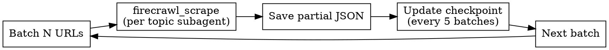

# Search Docs with Firecrawl

Automated documentation extraction using Firecrawl MCP tools with subagent isolation.

## Quick Reference

| Rate Limit (Firecrawl) | Batch Size | Delay |
|------------------------|------------|-------|
| Free: 2 concurrent, 10/min | 2 | 12s |
| Hobby: 5 concurrent, 100/min | 5 | 3s |
| Standard: 50 concurrent, 500/min | 25 | 3s |
| Growth: 100 concurrent, 5000/min | 50 | 0.6s |

**Output:** `data/<api>.json`

---

## Phase 1: Discovery

```
firecrawl_map(url) -> URLs list
```

Subagent classifies URLs into topic groups. Present tree to user:

```
api-name/
  authentication/
  models/
  api-reference/
    endpoints/
    errors/
```

**Wait for user approval before extraction.**

---

## Phase 2: Completeness Check

Subagent critic analyzes for gaps:
- Sublinks mentioned but not included
- Sidebar modules not in list
- Breadcrumbs indicating deeper hierarchy

Present gaps to user. Loop until user approves structure.

---

## Phase 3: Directory Setup

```
input/<api-name>/
  _metadata.json     # crawl info, date, version
  _checkpoint.json   # recovery progress
  <topic>/
    page1.json       # partial JSON per page
    page2.json
```

---

## Phase 4: Parallel Extraction



- One subagent per topic (context isolation)
- Respect rate limits per plan
- Each subagent generates JSON with keywords/use_cases/tags/priority

---

## Phase 5: Error Handling

| Error | Strategy |
|-------|----------|
| 429/5xx | Exponential backoff: 3 retries, max 30s delay |
| 4xx (not 429) | Log and skip URL |
| Empty page | Warning, skip |
| Short content (<100 chars) | Include with `low_quality: true` |
| Large content (>50KB) | Split into multiple sections |

Checkpoint saved every 5 batches. Resume from checkpoint on failure.

---

## Phase 6: Merge and Validation

1. Merge all partial JSONs into `data/<api>.json`
2. Subagent reviewer compares discovered vs extracted
3. Generate final report:

```
URLs discovered: 45
URLs extracted: 43
Skipped: 2 (404 errors)
Sections generated: 127
Quality warnings: 3 low_quality sections
```

---

## JSON Schema

```json
{
  "name": "api-name",
  "display_name": "Display Name",
  "version": "v1",
  "base_url": "https://docs.example.com",
  "sections": [{
    "title": "Section Title",
    "path": "section-slug",
    "url": "https://docs.example.com/section",
    "keywords": ["6-10 terms"],
    "use_cases": ["how to X", "when to Y"],
    "tags": ["getting-started", "api-reference"],
    "priority": 10,
    "content": "# Markdown content..."
  }]
}
```

**Priority scale:** 10=essential (auth, quickstart), 8-9=core features, 5-7=secondary, 1-4=edge cases

---

## Common Mistakes

| Mistake | Fix |
|---------|-----|
| Starting extraction without user approval | Always show tree and wait for explicit confirmation |
| Ignoring rate limits | Check plan limits, use appropriate batch size and delay |
| Processing all URLs in single context | Use one subagent per topic for isolation |
| No checkpoint for large crawls | Save checkpoint every 5 batches |
| Skipping completeness check | Run critic subagent to find gaps before extraction |

---

## Validation Checklist

Before saving final JSON:

- [ ] All required fields present (name, display_name, version, base_url, sections)
- [ ] Each section has: title, path, url, keywords (6-10), use_cases (3-5), tags (2-4), priority (1-10), content
- [ ] Keywords are searchable terms users would query
- [ ] Use cases are practical questions ("how to...", "when to...")
- [ ] URLs are valid and accessible
- [ ] Report shows discovered vs extracted counts
