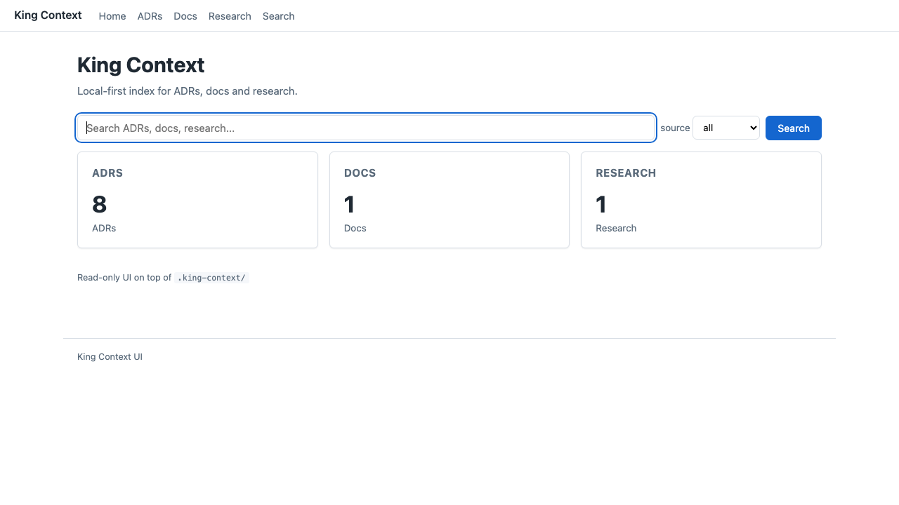
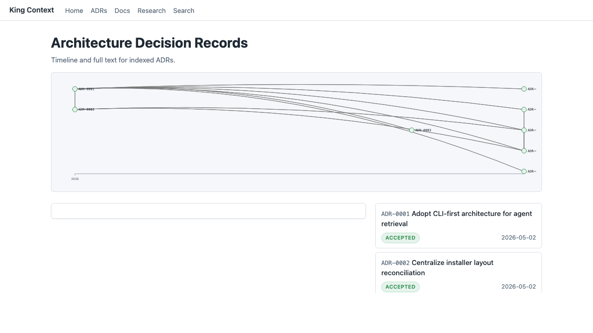
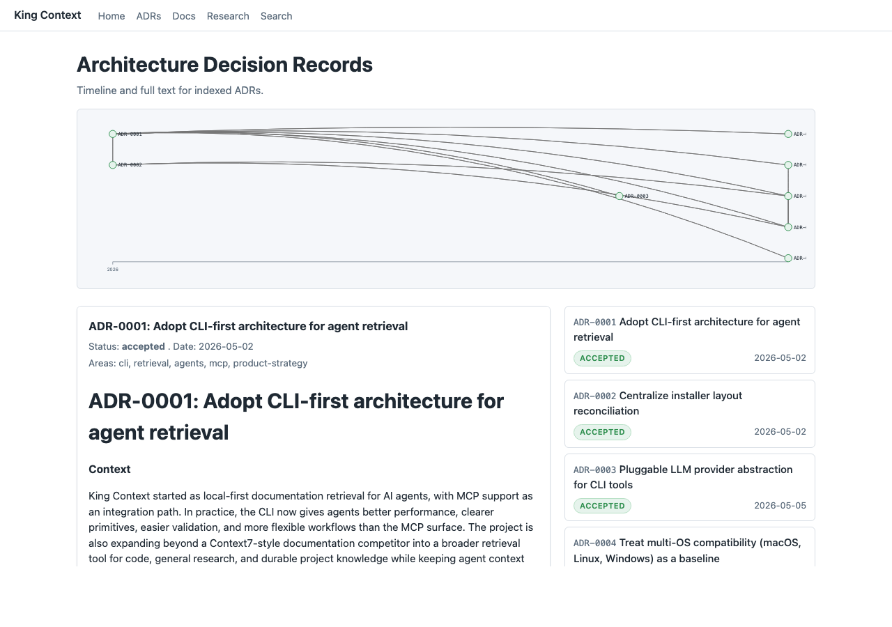
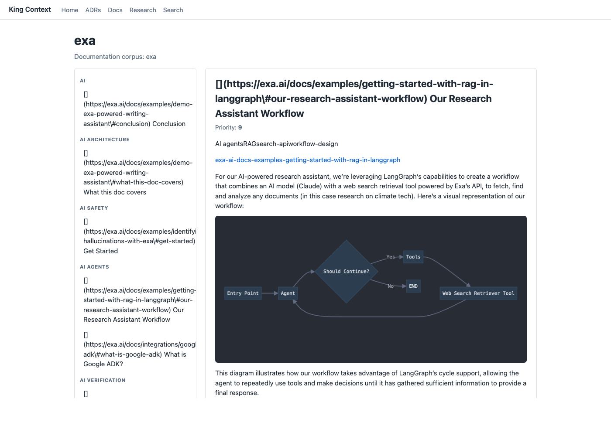
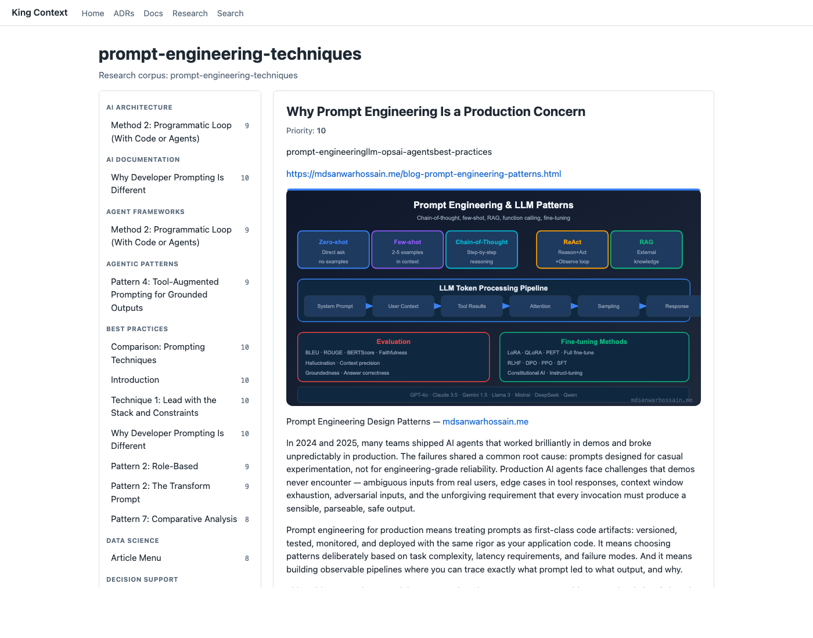
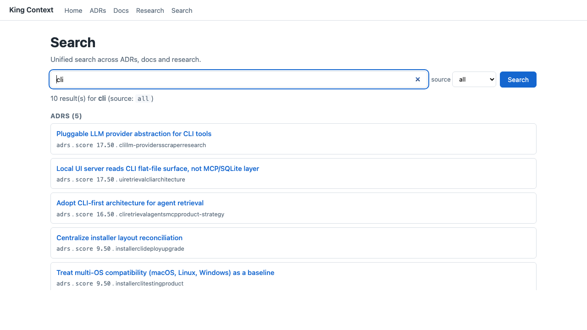

# Local UI

> **Beta.** The local UI is not 100% production ready. It ships as a
> working base to build on so the project can start delivering value
> while the interface evolves. Contributions to the UI and UX, anything
> that makes the pages more intuitive or easier to navigate, are very
> welcome.

A local, read-only web UI for browsing the ADRs, docs, and research indexed
in `.king-context/`. It is a quality-of-life aid for humans. The canonical
retrieval surface for agents is the `kctx` CLI (see ADR-0001).

The UI runs entirely on `127.0.0.1`. It does not call out to any network
service, and it does not write to disk. Edits still happen through the CLI
or your editor.

## Running

```bash
kctx ui
```

On startup the server picks a free port, prints the URL, and opens your
default browser. The terminal stays attached and prints a banner like:

```
King Context UI on http://127.0.0.1:7373 (Ctrl+C to stop)
```

Press `Ctrl+C` to stop.

### Flags

- `--port N`: bind to a specific port. Default is `7373`. If the port is
  busy, the server tries the next 19 ports (up to `7392`).
- `--host H`: bind to a specific host. Default is `127.0.0.1`. Public binds
  are not supported in the MVP. Passing `--host 0.0.0.0` exits with an
  error.
- `--no-open`: do not open the browser automatically. The URL is still
  printed in the terminal.

### Environment variables

- `KCTX_UI_PORT`: default port without needing `--port`. The flag wins if
  both are set.

## What each page shows

The pages below correspond to the screenshots in
`docs/assets/ui-local/`. The top navigation (`Home` / `ADRs` / `Docs` /
`Research` / `Search`) is present on every page.

### Home (`/`)



A title, a global search bar, and three cards: ADRs, Docs, Research. Each
card shows either a count of indexed entries or, when the source is empty,
an instructional hint. Each card is a link to the corresponding section.

### ADRs (`/adrs`, `/adrs/{id}`)



A horizontal SVG timeline at the top, with one node per ADR positioned by
date. Below the timeline, a side panel and a list view sit next to each
other. Click a node in the timeline, click an ADR in the list, or visit
`/adrs/{id}` directly to open that ADR in the side panel.



The side panel shows the ADR title, status badge, date, areas, full body,
and the neighborhood: related, supersedes, and superseded-by entries. A
referenced ID that does not exist in the index is rendered with a
`(broken)` label so reviewers can spot dangling links.

### Docs (`/docs/{name}`) and Research (`/research/{topic}`)





A sidebar lists the corpus sections grouped by tag. The center pane shows
the rendered Markdown of the section selected via URL or sidebar click.
The two routes are visually identical apart from the corpus subtitle.

Embedded media inside a section (images, diagrams, tables) is constrained
to the width of the content card, so wide assets scale down instead of
breaking the layout.

### Search (`/search`)



A unified search across ADRs, docs, and research. Pick a source from the
dropdown to narrow results. Each result shows the title, source label,
score, and matched tags or keywords when available. Results are grouped
by source.

## Empty states

When a source is missing or empty, the UI renders an instructional hint
in place of the data. Examples:

- No ADRs indexed: `Run kctx adr index to populate from .king-context/adr/*.md`.
- No docs corpora: `No docs indexed. Run king-scrape <url> or kctx index <file.json>`.
- No research corpora: `No research indexed. Run king-research <topic>`.
- `.king-context/` missing entirely: `Run npx @king-context/cli init to create the docs store`.

The page itself never errors out. Each source fails soft on its own.

## Limits in the MVP

The UI is read-only. Edits to ADRs and corpus sections happen via the CLI
or your editor. Refresh the page to see your changes. ADR validation,
linking, and supersession are CLI-only flows (`kctx adr ...`). See ADR-0006
for the full read-only decision and the rationale for deferring write
support.

## When to use UI vs CLI

- A human reviewing or exploring a corpus, scanning ADR relationships, or
  spot-checking metadata: use the UI.
- An agent retrieving context inside a workflow: use the `kctx` CLI.
- MCP server: legacy integration. The CLI is canonical. See ADR-0001 and
  ADR-0005.

## Troubleshooting

- **Port already in use**: the server tries `7373` through `7392`
  automatically. If all are busy, pass `--port N` to override or stop the
  process holding the port.
- **Browser does not open**: the server may be running on a host without a
  display, or the platform `webbrowser` handler returned an error. The URL
  is still printed in the terminal. Open it manually, or run with
  `--no-open` to skip the auto-open step.
- **`.king-context/` not found**: run `npx @king-context/cli init` to
  scaffold the directory layout. The UI starts even when the directory is
  missing, and each page renders an empty-state hint.
- **ADR shown as `(broken)`**: another ADR references this ID via
  `related`, `supersedes`, or `superseded_by`, but no matching file exists
  in `.king-context/adr/`. Check the directory and run `kctx adr validate`
  to surface the offending fields.
- **ADR with invalid frontmatter**: parse failures fall back to an
  instructional hint pointing at `kctx adr validate`. Other ADRs remain
  reachable.

## Roadmap

Future work. Not committed to a release.

- Read-write editing of ADRs and section metadata directly from the UI
  (ADR-0006).
- Expanded graph including docs and research nodes (ADR-0006).
- Review notes side-channel for batch agent processing.
- Theme overrides via `.king-context/ui-overrides/`.
- Stack migration to Starlette or FastAPI if complexity warrants
  (ADR-0007).
- Optional asset overrides outside the wheel-bundled defaults (ADR-0008).
